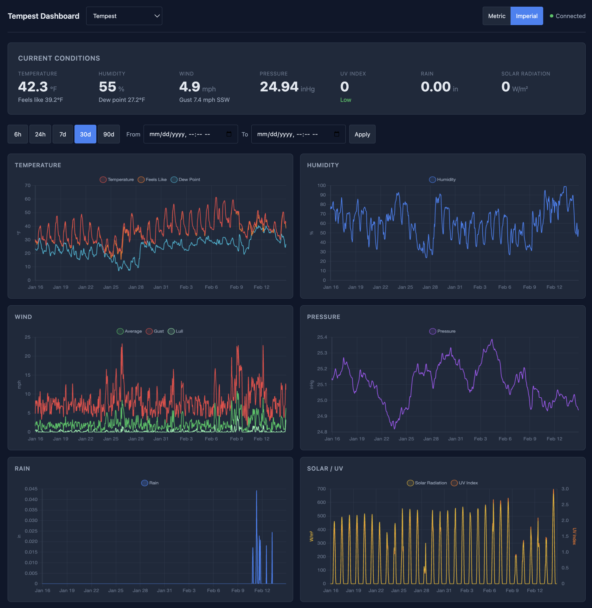
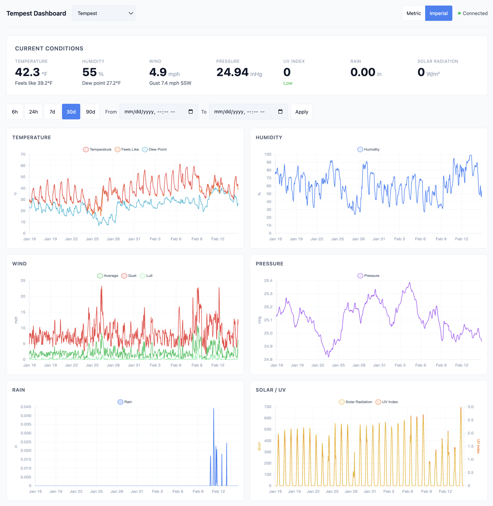

# tempest-dashboard

Lightweight weather dashboard for [tempestd](https://github.com/chadmayfield/tempestd). Vanilla JS, Chart.js, no build step. Plugin-extensible.

## Screenshots

<p>
  <a href="docs/screenshots/dark.png"></a>
  <a href="docs/screenshots/light.png"></a>
</p>

## Features

- **Current conditions** — temperature, humidity, wind, pressure, UV, rain, solar radiation
- **Historical charts** — 6 interactive chart panels with zoom/pan (temperature, humidity, wind, pressure, rain, solar/UV)
- **Time range presets** — 6h, 24h, 7d, 30d, 90d with automatic resolution downsampling
- **Custom date ranges** — pick any start/end period
- **Unit toggle** — metric/imperial (server-side conversion)
- **Multi-station support** — station selector dropdown
- **Auto-refresh** — polls every 60s, pauses when tab is hidden
- **Dark/light theme** — auto-switches based on OS preference, fully customizable via CSS variables
- **PWA** — installable, works offline with cached data
- **Plugin system** — extend with additional data sources (beehives, air quality, etc.)
- **No build step** — serve with any static file server

## Quick Start

```bash
# Serve the dashboard
python3 -m http.server 8000

# Open in browser with your tempestd server URL
open "http://localhost:8000?server=http://your-tempestd-server:8080"
```

## Configuration

The dashboard needs to know where your tempestd server is. There are three ways to configure this (checked in priority order):

1. **URL query parameter**: `?server=http://192.168.1.50:8080`
2. **localStorage**: Saved automatically when you connect via the config banner
3. **Same origin**: If you serve the dashboard behind a reverse proxy alongside tempestd

On first load, if the server can't be reached, a configuration banner will appear where you can enter the tempestd URL.

## Deployment

### Simple (development)

```bash
python3 -m http.server 8000
```

### nginx (production)

Production deployments should be served over HTTPS. The service worker requires HTTPS to function (except on localhost for development).

```nginx
server {
    listen 443 ssl;
    server_name weather.example.com;

    root /var/www/tempest-dashboard;
    index index.html;

    # Recommended security headers
    add_header X-Content-Type-Options nosniff;
    add_header X-Frame-Options DENY;
    add_header Referrer-Policy strict-origin-when-cross-origin;
    add_header Permissions-Policy "camera=(), microphone=(), geolocation=()";

    # Reverse proxy to tempestd (allows same-origin API access)
    location /api/ {
        proxy_pass http://localhost:8080;
    }
}
```

## Custom Themes

All styling uses CSS custom properties. Create a `theme.css` file alongside `index.html` to override defaults:

```css
:root {
    --bg-primary: #002b36;
    --bg-card: #073642;
    --text-primary: #839496;
    --accent: #268bd2;
    --color-temperature: #dc322f;
    --color-humidity: #2aa198;
    --font-family: 'IBM Plex Mono', monospace;
}
```

Or load a theme from a URL: `?theme=mytheme.css`

The dashboard auto-detects dark/light mode via `prefers-color-scheme`. The default theme includes both variants.

## Plugin System

The core dashboard is weather-only. Additional data sources are loaded as plugins — separate repos with ES modules loaded at runtime.

### Setup

Edit `plugins.json` to add plugins:

```json
[
    { "name": "beehive", "url": "/plugins/beehive/plugin.js" }
]
```

### Plugin Contract

Each plugin is an ES module with a default export:

```javascript
export default {
    name: 'my-plugin',
    label: 'My Plugin',
    servers: {
        myservice: {
            label: 'My Service',
            param: 'myservice',
            healthEndpoint: '/api/v1/health'
        }
    },
    init(ctx) { },
    render() { return '<div>...</div>'; },
    createCharts(ctx) { },
    refresh(ctx) { },
    destroy() { }
};
```

The context object (`ctx`) provides access to shared utilities:
- `ctx.state` — reactive state store
- `ctx.chartDefaults` — Chart.js helpers (baseOptions, makeDataset)
- `ctx.units` — current unit system
- `ctx.timeRange` — current time range
- `ctx.getServerUrl(name)` — resolve plugin server URL

### Trust Model

Plugins execute with full page privileges (same as any JavaScript on the page). **Only load plugins from sources you trust.** Plugins have full access to the page DOM, state, and network.

## Security

- **CSP**: Content Security Policy restricts script sources to `self` and the jsdelivr CDN
- **SRI**: All CDN scripts include Subresource Integrity hashes
- **XSS Prevention**: API data rendered via `textContent` / DOM APIs, never `innerHTML`
- **Input Validation**: Server URLs validated with `URL()` constructor; dates validated before use
- **No Secrets**: No API keys, tokens, or credentials stored in the frontend

## Development

### Dev Server

The dev server proxies `/api/` requests to a tempestd backend:

```bash
python3 scripts/serve.py --backend http://localhost:8080
```

### Testing

The test suite has 158 tests across four categories:

| Category | Tests | What it covers |
|---|---|---|
| Static analysis | 85 | HTML structure, JS source patterns, CSP, SRI, security |
| API proxy | 20 | Mock tempestd responses through the dev server proxy |
| Browser (Playwright) | 35 | Full runtime: bootstrap, DOM updates, Chart.js, user interactions |
| Static files | 18 | All files served correctly, manifest/SW validity |

```bash
# Install dependencies
pip install pytest pytest-playwright
playwright install chromium

# Run all tests
python -m pytest tests/ -v

# Run only browser tests
python -m pytest tests/test_browser.py -v
```

## License

MIT
